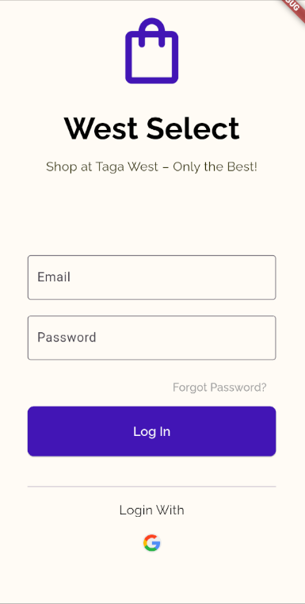

# WEST SELECT - A WVSU Buy and Sell Application

## About the App
WEST SELECT is a Flutter-based mobile application designed for the West Visayas State University (WVSU) community. It serves as a platform for different organizations at WVSU to sell their merchandise to taga-west students, making it easy to buy and sell within the campus community.

## Features
- User authentication (sign up, log in, log out)
- User profile with editable display name, description, and profile picture
- Browse and search for products
- Place and manage orders (pending and completed)
- View order details
- Shop management for sellers
- Secure transactions

## Tech Stack
- **Flutter**: UI development
- **Firebase Authentication**: User authentication
- **Cloud Firestore**: Real-time database
- **Firebase Storage**: Image and file storage
- **Dart**: Programming language
- **Provider/State Management**: (if used)

## Getting Started
### Prerequisites
- [Flutter SDK](https://flutter.dev/docs/get-started/install)
- [Dart SDK](https://dart.dev/get-dart) (usually included with Flutter)
- A Firebase project (with Authentication and Firestore enabled)

### Installation
1. **Clone the repository:**
   ```sh
   git clone <your-repo-url>
   cd west_select
   ```
2. **Install dependencies:**
   ```sh
   flutter pub get
   ```
3. **Configure Firebase:**
   - Add your `google-services.json` (Android) and `GoogleService-Info.plist` (iOS) to the respective directories as per [FlutterFire documentation](https://firebase.flutter.dev/docs/overview/).
4. **Run the app:**
   ```sh
   flutter run
   ```

## Usage
- **Sign up or log in** to your account.
- **Browse products** listed by various organizations.
- **Place orders** and track their status (pending/completed) in your profile.
- **Edit your profile** to update your display name, description, or profile picture.
- **Sellers** can manage their shop and inventory from the app.

## Screenshots
<p align="center">
  
</p>

## License
This project is for educational purposes only.
